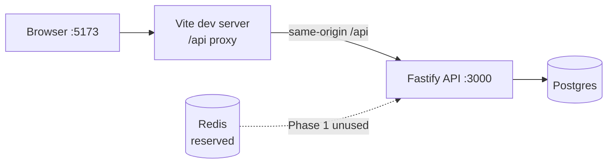

# NextRole

Job application tracker portfolio project. **Phase 1** ships a runnable npm-workspaces monorepo with Fastify cookie auth (Argon2id, refresh rotation + family reuse detection, CSRF, rate limits), a React/Vite login shell, Postgres via Prisma, Docker Compose (Postgres + Redis), Vitest, CI, and this README — then stops. No applications domain yet.

## Architecture



## Setup

Requires Node **22** (see `.nvmrc`).

```bash
# Postgres + Redis. Prefer `docker compose`; some hosts only have `docker-compose`.
docker compose up -d
# or: docker-compose up -d

cp .env.example .env
npm install
npm run db:migrate
npm run dev
```

- API: `http://localhost:3000`
- Web: `http://localhost:5173` (proxies `/api` → API)

## Environment

| Variable | Required | Default | Notes |
| --- | --- | --- | --- |
| `NODE_ENV` | yes | — | `development` \| `test` \| `production` |
| `PORT` | no | `3000` | API listen port |
| `DATABASE_URL` | yes | — | Prisma Postgres URL |
| `JWT_ACCESS_SECRET` | yes | — | min 32 chars |
| `REFRESH_TOKEN_PEPPER` | yes | — | min 32 chars; hashes refresh tokens at rest |
| `CORS_ORIGIN` | yes | — | comma-separated origins; credentials enabled |
| `COOKIE_SECURE` | yes | — | `true` / `false` |
| `ACCESS_TOKEN_TTL_SECONDS` | no | `900` | access JWT / cookie maxAge |
| `REFRESH_TOKEN_TTL_SECONDS` | no | `604800` | refresh + CSRF cookie maxAge (7d) |
| `REFRESH_REUSE_GRACE_MS` | no | `10000` | concurrent refresh grace window |
| `AUTH_RATE_LIMIT_MAX` | no | `20` | register/login/refresh |
| `AUTH_RATE_LIMIT_WINDOW_MS` | no | `60000` | rate-limit window |
| `ARGON2_MEMORY_COST` | no | `65536` | KiB |
| `ARGON2_TIME_COST` | no | `3` | iterations |
| `ARGON2_PARALLELISM` | no | `1` | threads |

Copy `.env.example` → `.env` for local defaults.

## Auth notes (Phase 1)

### Argon2id

Passwords use **Argon2id** with pinned defaults: `memoryCost=65536`, `timeCost=3`, `parallelism=1` (overridable via env). Login verifies against a dummy hash when the user is missing to reduce timing leaks.

### `__Host-` cookies deferred

Cookie names stay plain (`access_token`, `refresh_token`, `csrf_token`). `__Host-` is deferred: refresh uses `Path=/api/auth` (incompatible with `__Host-` path rules), and local HTTP lacks `Secure`.

### Vite proxy (same-origin)

Vite proxies `/api` → `http://localhost:3000` so the browser talks to one origin in development. Cookies use `SameSite=Lax`; Phase 1 assumes same-origin (proxy or reverse proxy), not a separate API host.

### Refresh grace mint

On refresh rotation, a just-revoked token may still mint a successor within `REFRESH_REUSE_GRACE_MS` by walking to the tip and calling the shared `mintSuccessor` path (helps concurrent tabs). Outside grace, reuse revokes the whole token family.

## Scripts

| Script | What |
| --- | --- |
| `npm run dev` | API + web watch (workspaces) |
| `npm run build` | Build all workspaces |
| `npm run test` | API Vitest suite |
| `npm run lint` | ESLint (api + web) |
| `npm run typecheck` | `tsc` in workspaces |
| `npm run format` | Prettier write |
| `npm run db:migrate` | `prisma migrate deploy` (api) |
| `npm run db:seed` | Seed stub (no Phase 1 data) |

## API (Phase 1)

| Method | Path | Notes |
| --- | --- | --- |
| `GET` | `/api/health` | liveness |
| `GET` | `/api/auth/csrf` | ensures CSRF cookie |
| `POST` | `/api/auth/register` | `201` `{ user }` + auth cookies; rate-limited |
| `POST` | `/api/auth/login` | `200` `{ user }` + auth cookies; rate-limited |
| `POST` | `/api/auth/refresh` | rotate refresh; CSRF; rate-limited |
| `POST` | `/api/auth/logout` | revoke current session; clear cookies; CSRF |
| `GET` | `/api/me` | current user; requires access JWT cookie |

Mutating routes require matching `Origin` and CSRF header/cookie double-submit.

## Testing

```bash
npm run test          # apps/api Vitest
npm run typecheck
npm run lint
npm run build
```

CI runs the same gate with a Postgres service container (see below). Frontend unit tests are out of Phase 1; manual smoke of login via Vite is enough.

## CI

GitHub Actions workflow [`.github/workflows/ci.yml`](.github/workflows/ci.yml): `npm ci` → migrate → lint → typecheck → api tests → build. Env secrets for JWT/pepper are CI placeholders; Postgres is a job service.

## Phase 1 non-goals

Applications CRUD, Kanban, activities, interviews, dashboard analytics, BullMQ workers, file uploads, email, AI, payments, shared packages, Turborepo, pnpm, Next.js, Redis-backed auth, session UI, `__Host-` cookies, multi-device session UI, email verification, password reset, git hooks (Husky).
