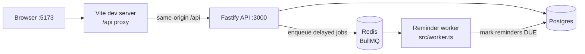

# NextRole

Job application tracker portfolio project. **Phase 1–5 + Soft Chromatic UI done on `main`** (auth, applications, Kanban, interviews, [PR #5](https://github.com/aniisabihi/NextRole/pull/5) UI, [PR #6](https://github.com/aniisabihi/NextRole/pull/6) dashboard analytics). **Phase 6 (reminders / BullMQ) done on branch `phase-6-reminders`, pending PR.** See `docs/PROJECT_CONTEXT.md` for roadmap and handoff context.

Full vision, phase status, and links to specs/plans live in **[docs/PROJECT_CONTEXT.md](docs/PROJECT_CONTEXT.md)**.

## Architecture



## Setup

Requires Node **22** (see `.nvmrc`).

```bash
# Postgres + Redis. Prefer `docker compose`; some hosts only have `docker-compose`.
docker compose up -d
# or: docker-compose up -d

cp .env.example apps/api/.env
npm install
npm exec -w apps/api -- prisma generate   # required after fresh install / wiped node_modules
npm run db:migrate
npm run dev
```

- API: `http://localhost:3000`
- Worker: started by `npm run dev` (needs Redis on `REDIS_URL`)
- Web: `http://localhost:5173` (proxies `/api` → API)

### Demo login

After `npm run db:seed` (once per database — persists until `migrate reset`):

| Field    | Value                 |
| -------- | --------------------- |
| email    | `demo@nextrole.local` |
| password | `password12`          |

Seed upserts that user and, if they have **zero** applications, creates 10 sample apps (mixed statuses / months) plus a few interviews. Re-running seed does **not** wipe apps you edited.

Avoid `npm audit fix --force` — it can break the prisma / `@prisma/client` version pair.

## Environment

| Variable                    | Required | Default                  | Notes                                                |
| --------------------------- | -------- | ------------------------ | ---------------------------------------------------- |
| `NODE_ENV`                  | yes      | —                        | `development` \| `test` \| `production`              |
| `PORT`                      | no       | `3000`                   | API listen port                                      |
| `DATABASE_URL`              | yes      | —                        | Prisma Postgres URL                                  |
| `JWT_ACCESS_SECRET`         | yes      | —                        | min 32 chars                                         |
| `REFRESH_TOKEN_PEPPER`      | yes      | —                        | min 32 chars; hashes refresh tokens at rest          |
| `CORS_ORIGIN`               | yes      | —                        | comma-separated origins; credentials enabled         |
| `COOKIE_SECURE`             | yes      | —                        | `true` / `false`                                     |
| `ACCESS_TOKEN_TTL_SECONDS`  | no       | `900`                    | access JWT / cookie maxAge                           |
| `REFRESH_TOKEN_TTL_SECONDS` | no       | `604800`                 | refresh + CSRF cookie maxAge (7d)                    |
| `REFRESH_REUSE_GRACE_MS`    | no       | `10000`                  | concurrent refresh grace window                      |
| `AUTH_RATE_LIMIT_MAX`       | no       | `20`                     | register/login/refresh                               |
| `AUTH_RATE_LIMIT_WINDOW_MS` | no       | `60000`                  | rate-limit window                                    |
| `ARGON2_MEMORY_COST`        | no       | `65536`                  | KiB                                                  |
| `ARGON2_TIME_COST`          | no       | `3`                      | iterations                                           |
| `ARGON2_PARALLELISM`        | no       | `1`                      | threads                                              |
| `REDIS_URL`                 | no       | `redis://127.0.0.1:6379` | BullMQ (API enqueue + worker); required up for tests |

Copy `.env.example` → `apps/api/.env` for local defaults (Prisma, Vitest setup, and `server.ts` all read that file; a root `.env` is only a fallback for the API process).

## Auth notes (Phase 1)

### Argon2id

Passwords use **Argon2id** with pinned defaults: `memoryCost=65536`, `timeCost=3`, `parallelism=1` (overridable via env). Login verifies against a dummy hash when the user is missing to reduce timing leaks.

### `__Host-` cookies deferred

Cookie names stay plain (`access_token`, `refresh_token`, `csrf_token`). `__Host-` is deferred: refresh uses `Path=/api/auth` (incompatible with `__Host-` path rules), and local HTTP lacks `Secure`.

### Vite proxy (same-origin)

Vite proxies `/api` → `http://localhost:3000` so the browser talks to one origin in development. Cookies use `SameSite=Lax`; Phase 1 assumes same-origin (proxy or reverse proxy), not a separate API host.

### Refresh grace mint

On refresh rotation, a just-revoked token may still mint a successor within `REFRESH_REUSE_GRACE_MS` by walking to the tip and calling the shared `mintSuccessor` path (helps concurrent tabs). Outside grace, reuse revokes the whole token family.

## Scripts

| Script                             | What                                                      |
| ---------------------------------- | --------------------------------------------------------- |
| `npm run dev`                      | API (:3000) + web (:5173) + worker via concurrently       |
| `npm run dev:worker -w apps/api`   | Reminder worker only (`tsx watch`)                        |
| `npm run worker -w apps/api`       | Reminder worker, no watch                                 |
| `npm run start:worker -w apps/api` | Built worker (`node dist/worker.js`)                      |
| `npm run build`                    | Build all workspaces                                      |
| `npm run test`                     | API Vitest suite                                          |
| `npm run test -w apps/web`         | Web Vitest suite (e.g. `canTransition` parity)            |
| `npm run lint`                     | ESLint (api + web)                                        |
| `npm run typecheck`                | `tsc` in workspaces                                       |
| `npm run format`                   | Prettier write                                            |
| `npm run db:migrate`               | `prisma migrate deploy` (api)                             |
| `npm run db:seed`                  | Upsert demo user + apps (idempotent; skips if apps exist) |

## API (Phase 1)

| Method | Path                 | Notes                                         |
| ------ | -------------------- | --------------------------------------------- |
| `GET`  | `/api/health`        | liveness                                      |
| `GET`  | `/api/auth/csrf`     | ensures CSRF cookie                           |
| `POST` | `/api/auth/register` | `201` `{ user }` + auth cookies; rate-limited |
| `POST` | `/api/auth/login`    | `200` `{ user }` + auth cookies; rate-limited |
| `POST` | `/api/auth/refresh`  | rotate refresh; CSRF; rate-limited            |
| `POST` | `/api/auth/logout`   | revoke current session; clear cookies; CSRF   |
| `GET`  | `/api/me`            | current user; requires access JWT cookie      |

Mutating routes require matching `Origin` and CSRF header/cookie double-submit.

## Testing

```bash
npm run test          # apps/api Vitest
npm run test -w apps/web
npm run typecheck
npm run lint
npm run build
```

API tests need Postgres **and Redis** up (`docker compose up -d`). CI runs the same gate with Postgres + Redis service containers (see below).

## CI

GitHub Actions workflow [`.github/workflows/ci.yml`](.github/workflows/ci.yml): `npm ci` → migrate → lint → typecheck → api tests → web tests → build. Env secrets for JWT/pepper are CI placeholders; Postgres and Redis are job services (`REDIS_URL=redis://localhost:6379`).

## Phase 1 non-goals

Kanban, interviews, dashboard analytics, file uploads, email, AI, payments, shared packages, Turborepo, pnpm, Next.js, Redis-backed auth, session UI, `__Host-` cookies, multi-device session UI, email verification, password reset, git hooks (Husky).

## Phase 2 — Applications core

User-owned job applications: CRUD, list/search/filter/sort, soft status transitions, activity timeline, React list/create/detail pages.

### How to run

Same as Setup above:

```bash
docker compose up -d   # or docker-compose up -d
cp .env.example apps/api/.env
npm install
npm run db:migrate
npm run dev            # API :3000 + web :5173 + worker (Vite proxies /api)
```

Web routes: `/applications`, `/applications/new`, `/applications/:id`. Dashboard links to recent applications (no fake stats).

### Employment vs workplace

Two independent dimensions (not one combined enum):

| Field            | Values                                                      | Meaning                       |
| ---------------- | ----------------------------------------------------------- | ----------------------------- |
| `employmentType` | `FULL_TIME`, `PART_TIME`, `CONTRACT`, `INTERNSHIP`, `OTHER` | Contract / hours relationship |
| `workplaceType`  | `ON_SITE`, `HYBRID`, `REMOTE`                               | Where work happens            |

### Enums

| Enum                | Values                                                                                                |
| ------------------- | ----------------------------------------------------------------------------------------------------- |
| `ApplicationStatus` | `SAVED`, `APPLIED`, `SCREENING`, `INTERVIEW`, `TECHNICAL_INTERVIEW`, `OFFER`, `REJECTED`, `WITHDRAWN` |
| `Priority`          | `LOW`, `MEDIUM`, `HIGH` (sort via `priorityRank`: 1 / 2 / 3)                                          |
| `ActivityType`      | `APPLICATION_CREATED`, `STATUS_CHANGED`, `FIELDS_UPDATED`                                             |

### Soft status transition matrix

**Pipeline (non-terminal):** `SAVED`, `APPLIED`, `SCREENING`, `INTERVIEW`, `TECHNICAL_INTERVIEW`  
**Terminal:** `OFFER`, `REJECTED`, `WITHDRAWN`

| From \ To            | Non-terminal              | Terminal |
| -------------------- | ------------------------- | -------- |
| Non-terminal         | allow                     | allow    |
| `OFFER` / `REJECTED` | **deny**                  | allow    |
| `WITHDRAWN`          | only `SAVED` or `APPLIED` | allow    |

- `from === to` → no-op (no write, no activity).
- Deny → `400` `INVALID_STATUS_TRANSITION`.
- Create may set any initial status (no transition check); only `APPLICATION_CREATED` activity.

### API (Phase 2)

All routes require auth cookies. Mutations need CSRF + Origin (same as Phase 1).

| Method   | Path                               | Success                                  |
| -------- | ---------------------------------- | ---------------------------------------- |
| `GET`    | `/api/applications`                | `200` `{ items, total, page, pageSize }` |
| `POST`   | `/api/applications`                | `201` `{ application }`                  |
| `GET`    | `/api/applications/:id`            | `200` `{ application }`                  |
| `PATCH`  | `/api/applications/:id`            | `200` `{ application }`                  |
| `DELETE` | `/api/applications/:id`            | `204`                                    |
| `GET`    | `/api/applications/:id/activities` | `200` `{ items }` newest-first           |

**List query:** `q`, `status`, `company`, `employmentType`, `workplaceType`, `priority`, `sort` (`updatedAt` \| `createdAt` \| `dateApplied` \| `priority` \| `status`), `order` (`asc` \| `desc`), `page`, `pageSize` (max 50 in Phase 2; **max 100 since Phase 3**, see below).

**Activities:** soft cap **200** newest rows per application (no pagination UI yet). No public write API — rows created as side effects of create/PATCH.

**Ownership:** every query scoped to `request.userId`; wrong/missing id → `404` `NOT_FOUND`.

### Spec / plan

- Spec: `docs/superpowers/specs/2026-09-30-nextrole-phase2-design.md`
- Plan: `docs/superpowers/plans/2026-09-30-nextrole-phase2.md`

## Phase 3 — Kanban board

Route `/board` (nav: Dashboard · Applications · Board). Eight status columns, priority swimlanes (HIGH → MEDIUM → LOW) inside each column, drag to change status, drag within a cell to reorder, Cmd/Ctrl-click multi-select for bulk status moves.

### API (Phase 3)

All routes require auth cookies; mutations need CSRF + Origin. `/board/*` routes are registered **before** `/:id`.

| Method  | Path                                  | Success                                              |
| ------- | ------------------------------------- | ---------------------------------------------------- |
| `GET`   | `/api/applications`                   | `pageSize` max now **100** (was 50); `101` → `400`   |
| `PATCH` | `/api/applications/:id`               | status/priority change also places `boardOrder`      |
| `POST`  | `/api/applications/board/reorder`     | `200` `{ ok: true }`                                 |
| `POST`  | `/api/applications/board/bulk-status` | `200` `{ moved: Application[], skipped: Skipped[] }` |

**`boardOrder`** — int on `Application`, order within cell `(userId, status, priority)`. Index `(userId, status, priority, boardOrder)`. Migration backfills `0..n-1` per cell by `updatedAt desc`. Create and moves append to end of target cell. Delete leaves gaps (no compaction). `priorityRank` unchanged (still set whenever `priority` is written).

**Placement rules:** status-only PATCH → end of `(newStatus, priority)`. Priority-only PATCH → end of `(status, newPriority)`. Both in one PATCH → single placement in final cell. Reorder writes no activity rows.

**`POST /api/applications/board/reorder`** body `{ status, priority, orderedIds }`. `orderedIds` must be the **exact full set** of ids in that cell (no missing, extra or duplicate; 1–100). Any violation (incl. unknown / not-owned id) → `400 VALIDATION_ERROR`, nothing written. Atomic; last-write-wins on concurrent edits.

**`POST /api/applications/board/bulk-status`** body `{ ids, toStatus }`. `ids` deduped (first-seen order), 1–100 unique, else `400 VALIDATION_ERROR`. Processed sequentially, each id independent (earlier successes persist). Each card keeps its priority and is appended to `(toStatus, priority)`. Always `200`.

Skip codes in `skipped[]` (`{ id, code, message }`):

| Code                        | When                                               |
| --------------------------- | -------------------------------------------------- |
| `NOT_FOUND`                 | id missing or not owned by caller                  |
| `ALREADY_IN_STATUS`         | card already at `toStatus` (no activity, no write) |
| `INVALID_STATUS_TRANSITION` | `assertTransition` denies (Phase 2 matrix)         |

### Board UX

- Loads `GET /api/applications?pageSize=100&sort=updatedAt&order=desc&page=1`, groups client-side by status × priority, sorts by `boardOrder`.
- If `total > 100`: banner "Showing N of M" (most recently updated only); Applications list stays source of truth.
- Web mirrors the transition matrix in `apps/web/src/lib/status-transitions.ts` (`canTransition`); illegal single drops are blocked client-side with an announcement. Server still validates.
- Drag **handle** starts a drag; clicking the card body opens detail.
- Same-status drop with no index change → no API call. Within-cell drop → `board/reorder`. Cross-lane (same column), single card → priority PATCH. Cross-column → status PATCH.
- Multi-select: Cmd/Ctrl-click toggles, Escape clears, count announced. Dragging a selected card to a **column** → `bulk-status` and announces "Moved N, skipped M". Multi-drag to a lane is unsupported (message, no-op). No touch/checkbox multi-select, no Shift-range in v1.
- Focus returns to the moved card's handle after a drop.
- Motion respects `prefers-reduced-motion`.

### Manual a11y checklist

Run before merging board changes (`npm run dev`, open `/board`, seed a few applications across statuses and priorities).

- [ ] **Keyboard reach:** Tab from nav reaches board; each column is a labeled region; focus ring visible on handles, cards, buttons.
- [ ] **Keyboard column move:** focus a drag handle, Space/Enter to pick up, Arrow keys to another column, Space/Enter to drop. Status changes (legal move) or an error is announced (illegal move).
- [ ] **Keyboard lane move:** same, arrow into a different priority lane in the same column; priority updates.
- [ ] **Keyboard reorder:** pick up, arrow within the same cell, drop; order persists after reload. Escape cancels and announces cancel.
- [ ] **Live region:** screen reader (VoiceOver: Cmd+F5) announces pick-up, over-target, and outcome ("Moved …", "Reordered …", "Cannot move …", "Moved N, skipped M").
- [ ] **Focus restore:** after drop (success, reject or error) focus returns to the moved card's handle.
- [ ] **Reduced motion:** enable OS "Reduce motion"; drag settle/overlay animation absent.
- [ ] **Handle vs click:** clicking / Enter on card body opens detail without dragging; only the handle starts a drag; a short pointer jitter does not drag.
- [ ] **Multi-select:** Cmd (macOS) / Ctrl (other) click toggles selection; count announced; Escape clears; "Clear selection" button works; drag a selected card to a column moves all and announces "Moved N, skipped M"; multi-drag to a lane shows unsupported message.
- [ ] **Not color-only:** status and priority readable as text on every card.
- [ ] **Contrast / targets:** text and controls meet WCAG AA; handles and buttons ≈ 44px.
- [ ] **Truncation banner:** with >100 applications, banner "Showing N of M" appears (no link yet; use Applications nav).

### Spec / plan

- Spec: `docs/superpowers/specs/2026-10-01-nextrole-phase3-design.md`
- Plan: `docs/superpowers/plans/2026-10-01-nextrole-phase3.md`

## Phase 4 — Interviews

Interviews nested under an application: schedule, edit, change status, delete. Detail page shows **Upcoming** and **Past** sections plus interview events in the activity timeline.

### API (Phase 4)

All routes require auth cookies and a caller-owned application (else `404`). Mutations need CSRF + Origin.

| Method   | Path                                              | Success               |
| -------- | ------------------------------------------------- | --------------------- |
| `GET`    | `/api/applications/:applicationId/interviews`     | `200` `{ items }`     |
| `POST`   | `/api/applications/:applicationId/interviews`     | `201` `{ interview }` |
| `PATCH`  | `/api/applications/:applicationId/interviews/:id` | `200` `{ interview }` |
| `DELETE` | `/api/applications/:applicationId/interviews/:id` | `204` (no body)       |

- List ordered `scheduledAt` asc, `id` asc tiebreaker.
- PATCH needs at least one field; no-op PATCH returns the row, no write, no activity.
- Cap: **50** interviews per application (checked inside the create transaction) → `400` `INTERVIEW_LIMIT_EXCEEDED`.
- `scheduledAt` must be an ISO-8601 datetime **with offset** (`2026-10-05T14:30:00+02:00` or `Z`); offset-less values → `400`. Stored/returned as UTC. Compared at epoch-minute precision on PATCH.
- Invalid body → `400` `VALIDATION_ERROR` (never `500`). Empty string for `interviewer`, `locationOrUrl`, `notes` is treated as unset/null.

### Enums

| Enum              | Values                                                                                                                                           |
| ----------------- | ------------------------------------------------------------------------------------------------------------------------------------------------ |
| `InterviewType`   | `PHONE`, `VIDEO`, `ONSITE`, `TECHNICAL`, `OTHER`                                                                                                 |
| `InterviewStatus` | `SCHEDULED`, `COMPLETED`, `CANCELLED`, `NO_SHOW`                                                                                                 |
| `ActivityType`    | Phase 2 values + `INTERVIEW_CREATED`, `INTERVIEW_UPDATED` (field diff), `INTERVIEW_STATUS_CHANGED` (`from`/`to`), `INTERVIEW_DELETED` (snapshot) |

`typeLabel` (max 100) is **required when `type = OTHER`** (empty/blank → `400`) and forced to `null` for every other type.

### One-way status + terminal locks

- `SCHEDULED` → `COMPLETED` | `CANCELLED` | `NO_SHOW`. Terminal states never go back (not even to `SCHEDULED`) → `400` `INVALID_INTERVIEW_STATUS_TRANSITION`.
- `from === to` → no-op.
- On a non-`SCHEDULED` interview, `scheduledAt`, `type`, `typeLabel` are **locked** → `400` `INTERVIEW_TERMINAL_FIELDS_LOCKED`. `interviewer`, `locationOrUrl`, `notes` stay editable.
- A PATCH changing status **and** fields writes two activities (`INTERVIEW_STATUS_CHANGED` + `INTERVIEW_UPDATED`) in one transaction.
- DELETE writes `INTERVIEW_DELETED` (snapshot) then removes the row; activities survive. Deleting the application cascades interviews.
- Web mirrors the transition rule in `apps/web/src/lib/interview-status-transitions.ts`; server still validates.

### Known residual: concurrent status race

Status check reads then writes without a row lock. Two concurrent PATCHes on the same `SCHEDULED` interview (e.g. `COMPLETED` vs `CANCELLED`) are **last-write-wins**; both may log a status activity. Acceptable for single-user app; revisit with conditional `updateMany` if needed.

### Manual checklist

Run before merging interview changes (`npm run dev`, open an application detail page).

- [ ] **Create:** add an interview (each type). `OTHER` requires a label; label field hidden/cleared for other types.
- [ ] **Datetime:** entered local time shows the same wall time after reload; API payload carries an offset.
- [ ] **Upcoming vs Past:** future `SCHEDULED` appears in Upcoming; past-dated `SCHEDULED` appears in **Past**; completed/cancelled/no-show always in Past.
- [ ] **Status:** mark Completed / Cancelled / No-show; no way back to Scheduled; date/type controls disabled afterwards.
- [ ] **Edit:** change interviewer/location/notes on a finished interview (allowed); URL location renders as a safe link.
- [ ] **Delete:** confirm prompt; row disappears; timeline shows "deleted" entry.
- [ ] **Timeline:** created / updated (field diff) / status changed / deleted entries read correctly.
- [ ] **Cap:** 51st interview → error message shown.
- [ ] **Isolation:** another user's application interviews return `404`.

### Spec / plan

- Spec: `docs/superpowers/specs/2026-10-01-nextrole-phase4-design.md`
- Plan: `docs/superpowers/plans/2026-10-01-nextrole-phase4.md`

## Phase 5 — Dashboard analytics

Real aggregates on `/dashboard`: totals, status breakdown, offer/rejection rates, interview counts, 6-month applications-created chart. Recent applications list unchanged (separate `GET /api/applications?pageSize=5` fetch).

### API (Phase 5)

| Method | Path                   | Success                                                                        |
| ------ | ---------------------- | ------------------------------------------------------------------------------ |
| `GET`  | `/api/dashboard/stats` | `200` `{ totals, byStatus, rates, interviews, monthlyCreated }`; auth required |

Read-only (no CSRF). Every aggregate scoped to the authenticated user. Unauthenticated → `401`. Code: `apps/api/src/modules/dashboard/`.

### Formulas

- `terminalCount` = `OFFER + REJECTED + WITHDRAWN`.
- `offerRate` = `OFFER / max(1, terminalCount)`; `rejectionRate` = `REJECTED / max(1, terminalCount)`. `WITHDRAWN` counts in the denominator. Raw floats in `[0, 1]` (no API rounding); web shows `Math.round(rate * 100)%`.
- `totals.activePipeline` = applications with status not in `{OFFER, REJECTED, WITHDRAWN}`.
- `byStatus` always has all eight `ApplicationStatus` keys (`0` if none).
- `monthlyCreated` = last **6** UTC calendar months (current + 5 prior) by `Application.createdAt`, oldest → newest, `YYYY-MM`, zero-count months included.
- `interviews.upcoming` = `SCHEDULED` and `scheduledAt >= now`. `interviews.completed` = status `COMPLETED` (all time). `CANCELLED` / `NO_SHOW` counted in neither.

**Overdue `SCHEDULED`:** an interview still `SCHEDULED` with `scheduledAt < now` is neither `upcoming` nor `completed` (intentional; no overdue bucket in Phase 5).

### Charts

CSS/SVG-style bars only — **no chart library**. Month chart is a `<figure>` with an `aria-label` summary and an sr-only list of per-month counts; visual bars are `aria-hidden`.

### Empty state

No fake data. Account with no applications → zeros everywhere, no `NaN` rates (`terminalCount === 0` → both rates `0`), month chart still renders six zero bars with "No applications yet" copy, recent list shows its own empty message.

### Manual smoke

- [ ] Empty user: zeros, empty recent, no `NaN`.
- [ ] Create applications / interviews: counts and chart update after refresh.
- [ ] Overdue `SCHEDULED` interview: in neither upcoming nor completed.
- [ ] Second user: isolated stats.
- [ ] Chart: month summary reachable by screen reader.

### Spec / plan

- Spec: `docs/superpowers/specs/2026-10-01-nextrole-phase5-design.md`
- Plan: `docs/superpowers/plans/2026-10-01-nextrole-phase5.md`

## Phase 6 — Reminders (BullMQ)

In-app reminders. **Postgres `Reminder` rows are source of truth**; BullMQ delayed jobs on Redis mirror the schedule. A separate worker process (`apps/api/src/worker.ts`) flips due reminders `SCHEDULED` → `DUE`. No email/SMS/push.

### Kinds

| Kind        | Created                                                                          | Default                   |
| ----------- | -------------------------------------------------------------------------------- | ------------------------- |
| `MANUAL`    | by user on an application                                                        | any future `dueAt`        |
| `INTERVIEW` | auto, lead time before `Interview.scheduledAt`                                   | `interviewLeadHours` = 24 |
| `FOLLOW_UP` | auto, N days after entering `{APPLIED, SCREENING}`; `APPLIED→SCREENING` no reset | `followUpDays` = 7        |

Statuses: `SCHEDULED`, `DUE`, `DISMISSED`, `CANCELLED`.

### API (Phase 6)

All routes require auth cookies; mutations need CSRF + Origin.

| Method   | Path                                         | Success                                            |
| -------- | -------------------------------------------- | -------------------------------------------------- |
| `POST`   | `/api/applications/:applicationId/reminders` | `201` MANUAL reminder (`title`, `body?`, `dueAt`)  |
| `GET`    | `/api/reminders`                             | list; `status` (csv), `applicationId`, `limit` ≤50 |
| `PATCH`  | `/api/reminders/:id`                         | edit fields, or `{ status: "DISMISSED" }` alone    |
| `DELETE` | `/api/reminders/:id`                         | `204`; soft `CANCELLED`, MANUAL only               |
| `GET`    | `/api/me/reminder-prefs`                     | `{ interviewLeadHours, followUpDays }`             |
| `PATCH`  | `/api/me/reminder-prefs`                     | saving reschedules open `SCHEDULED` auto reminders |

### Worker

- Job id `reminder-${id}-${dueAtMs}` (BullMQ forbids `:`), stored in `bullJobId`; remove-then-add on reschedule.
- Fire uses CAS (`updateMany` where `status=SCHEDULED`); activity row written only when count = 1.
- **Reconcile** on worker boot **and** sweep every ~60s: re-enqueues missing jobs; overdue `SCHEDULED` enqueue with delay 0. Redis `FLUSHDB` self-heals.
- Enqueue failure is logged, never fails the HTTP request; sweep repairs.
- Timeline logs fire and dismiss only.

### Web

Nav bell + dropdown (polls `GET /api/reminders` ~30–60s and on focus), Reminders section on application detail, prefs modal.

### Manual smoke

1. `docker compose up -d`; `npm run dev` (api + web + worker).
2. MANUAL due in ~1 min → bell shows DUE without full reload.
3. Interview +36h → INTERVIEW reminder; delete interview → gone from bell.
4. Create app as `APPLIED` → FOLLOW_UP; move `APPLIED→SCREENING` → same reminder.
5. Prefs `followUpDays` 1 → `dueAt` moves from `createdAt`.
6. `FLUSHDB` while worker runs → jobs restored / overdue fired within ~60s.
7. Bell: keyboard open/Esc/focus; prefs modal focus trap.

### Spec / plan

- Spec: `docs/superpowers/specs/2026-10-01-nextrole-phase6-design.md`
- Plan: `docs/superpowers/plans/2026-10-01-nextrole-phase6.md`
