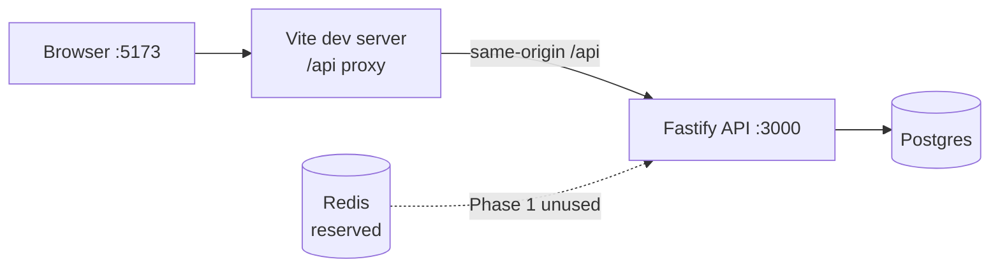

# NextRole

Job application tracker portfolio project. **Phase 1 (done):** auth foundation. **Phase 2 (done on `main`, [PR #2](https://github.com/aniisabihi/NextRole/pull/2)):** applications core. **Next:** Phase 3 Kanban. See `docs/PROJECT_CONTEXT.md` for roadmap and handoff context.

Full vision, phase status, and links to specs/plans live in **[docs/PROJECT_CONTEXT.md](docs/PROJECT_CONTEXT.md)**.

## Architecture



## Setup

Requires Node **22** (see `.nvmrc`).

```bash
# Postgres + Redis. Prefer `docker compose`; some hosts only have `docker-compose`.
docker compose up -d
# or: docker-compose up -d

cp .env.example apps/api/.env
npm install
npm exec -w apps/api -- prisma generate   # required after fresh install / wiped node_modules
npm run db:migrate
npm run dev
```

- API: `http://localhost:3000`
- Web: `http://localhost:5173` (proxies `/api` → API)

Avoid `npm audit fix --force` — it can break the prisma / `@prisma/client` version pair.

## Environment

| Variable                    | Required | Default  | Notes                                        |
| --------------------------- | -------- | -------- | -------------------------------------------- |
| `NODE_ENV`                  | yes      | —        | `development` \| `test` \| `production`      |
| `PORT`                      | no       | `3000`   | API listen port                              |
| `DATABASE_URL`              | yes      | —        | Prisma Postgres URL                          |
| `JWT_ACCESS_SECRET`         | yes      | —        | min 32 chars                                 |
| `REFRESH_TOKEN_PEPPER`      | yes      | —        | min 32 chars; hashes refresh tokens at rest  |
| `CORS_ORIGIN`               | yes      | —        | comma-separated origins; credentials enabled |
| `COOKIE_SECURE`             | yes      | —        | `true` / `false`                             |
| `ACCESS_TOKEN_TTL_SECONDS`  | no       | `900`    | access JWT / cookie maxAge                   |
| `REFRESH_TOKEN_TTL_SECONDS` | no       | `604800` | refresh + CSRF cookie maxAge (7d)            |
| `REFRESH_REUSE_GRACE_MS`    | no       | `10000`  | concurrent refresh grace window              |
| `AUTH_RATE_LIMIT_MAX`       | no       | `20`     | register/login/refresh                       |
| `AUTH_RATE_LIMIT_WINDOW_MS` | no       | `60000`  | rate-limit window                            |
| `ARGON2_MEMORY_COST`        | no       | `65536`  | KiB                                          |
| `ARGON2_TIME_COST`          | no       | `3`      | iterations                                   |
| `ARGON2_PARALLELISM`        | no       | `1`      | threads                                      |

Copy `.env.example` → `apps/api/.env` for local defaults (Prisma, Vitest setup, and `server.ts` all read that file; a root `.env` is only a fallback for the API process).

## Auth notes (Phase 1)

### Argon2id

Passwords use **Argon2id** with pinned defaults: `memoryCost=65536`, `timeCost=3`, `parallelism=1` (overridable via env). Login verifies against a dummy hash when the user is missing to reduce timing leaks.

### `__Host-` cookies deferred

Cookie names stay plain (`access_token`, `refresh_token`, `csrf_token`). `__Host-` is deferred: refresh uses `Path=/api/auth` (incompatible with `__Host-` path rules), and local HTTP lacks `Secure`.

### Vite proxy (same-origin)

Vite proxies `/api` → `http://localhost:3000` so the browser talks to one origin in development. Cookies use `SameSite=Lax`; Phase 1 assumes same-origin (proxy or reverse proxy), not a separate API host.

### Refresh grace mint

On refresh rotation, a just-revoked token may still mint a successor within `REFRESH_REUSE_GRACE_MS` by walking to the tip and calling the shared `mintSuccessor` path (helps concurrent tabs). Outside grace, reuse revokes the whole token family.

## Scripts

| Script               | What                                                   |
| -------------------- | ------------------------------------------------------ |
| `npm run dev`        | API (:3000) + web (:5173) in parallel via concurrently |
| `npm run build`      | Build all workspaces                                   |
| `npm run test`       | API Vitest suite                                       |
| `npm run lint`       | ESLint (api + web)                                     |
| `npm run typecheck`  | `tsc` in workspaces                                    |
| `npm run format`     | Prettier write                                         |
| `npm run db:migrate` | `prisma migrate deploy` (api)                          |
| `npm run db:seed`    | Seed stub (no Phase 1 data)                            |

## API (Phase 1)

| Method | Path                 | Notes                                         |
| ------ | -------------------- | --------------------------------------------- |
| `GET`  | `/api/health`        | liveness                                      |
| `GET`  | `/api/auth/csrf`     | ensures CSRF cookie                           |
| `POST` | `/api/auth/register` | `201` `{ user }` + auth cookies; rate-limited |
| `POST` | `/api/auth/login`    | `200` `{ user }` + auth cookies; rate-limited |
| `POST` | `/api/auth/refresh`  | rotate refresh; CSRF; rate-limited            |
| `POST` | `/api/auth/logout`   | revoke current session; clear cookies; CSRF   |
| `GET`  | `/api/me`            | current user; requires access JWT cookie      |

Mutating routes require matching `Origin` and CSRF header/cookie double-submit.

## Testing

```bash
npm run test          # apps/api Vitest
npm run typecheck
npm run lint
npm run build
```

CI runs the same gate with a Postgres service container (see below). Frontend unit tests are out of Phase 1; manual smoke of login via Vite is enough.

## CI

GitHub Actions workflow [`.github/workflows/ci.yml`](.github/workflows/ci.yml): `npm ci` → migrate → lint → typecheck → api tests → build. Env secrets for JWT/pepper are CI placeholders; Postgres is a job service.

## Phase 1 non-goals

Kanban, interviews, dashboard analytics, BullMQ workers, file uploads, email, AI, payments, shared packages, Turborepo, pnpm, Next.js, Redis-backed auth, session UI, `__Host-` cookies, multi-device session UI, email verification, password reset, git hooks (Husky).

## Phase 2 — Applications core

User-owned job applications: CRUD, list/search/filter/sort, soft status transitions, activity timeline, React list/create/detail pages.

### How to run

Same as Setup above:

```bash
docker compose up -d   # or docker-compose up -d
cp .env.example apps/api/.env
npm install
npm run db:migrate
npm run dev            # API :3000 + web :5173 (Vite proxies /api)
```

Web routes: `/applications`, `/applications/new`, `/applications/:id`. Dashboard links to recent applications (no fake stats).

### Employment vs workplace

Two independent dimensions (not one combined enum):

| Field            | Values                                              | Meaning                          |
| ---------------- | --------------------------------------------------- | -------------------------------- |
| `employmentType` | `FULL_TIME`, `PART_TIME`, `CONTRACT`, `INTERNSHIP`, `OTHER` | Contract / hours relationship   |
| `workplaceType`  | `ON_SITE`, `HYBRID`, `REMOTE`                       | Where work happens               |

### Enums

| Enum               | Values                                                                                         |
| ------------------ | ---------------------------------------------------------------------------------------------- |
| `ApplicationStatus`| `SAVED`, `APPLIED`, `SCREENING`, `INTERVIEW`, `TECHNICAL_INTERVIEW`, `OFFER`, `REJECTED`, `WITHDRAWN` |
| `Priority`         | `LOW`, `MEDIUM`, `HIGH` (sort via `priorityRank`: 1 / 2 / 3)                                   |
| `ActivityType`     | `APPLICATION_CREATED`, `STATUS_CHANGED`, `FIELDS_UPDATED`                                      |

### Soft status transition matrix

**Pipeline (non-terminal):** `SAVED`, `APPLIED`, `SCREENING`, `INTERVIEW`, `TECHNICAL_INTERVIEW`  
**Terminal:** `OFFER`, `REJECTED`, `WITHDRAWN`

| From \ To            | Non-terminal              | Terminal |
| -------------------- | ------------------------- | -------- |
| Non-terminal         | allow                     | allow    |
| `OFFER` / `REJECTED` | **deny**                  | allow    |
| `WITHDRAWN`          | only `SAVED` or `APPLIED` | allow    |

- `from === to` → no-op (no write, no activity).
- Deny → `400` `INVALID_STATUS_TRANSITION`.
- Create may set any initial status (no transition check); only `APPLICATION_CREATED` activity.

### API (Phase 2)

All routes require auth cookies. Mutations need CSRF + Origin (same as Phase 1).

| Method   | Path                               | Success                        |
| -------- | ---------------------------------- | ------------------------------ |
| `GET`    | `/api/applications`                | `200` `{ items, total, page, pageSize }` |
| `POST`   | `/api/applications`                | `201` `{ application }`        |
| `GET`    | `/api/applications/:id`            | `200` `{ application }`        |
| `PATCH`  | `/api/applications/:id`            | `200` `{ application }`        |
| `DELETE` | `/api/applications/:id`            | `204`                          |
| `GET`    | `/api/applications/:id/activities` | `200` `{ items }` newest-first |

**List query:** `q`, `status`, `company`, `employmentType`, `workplaceType`, `priority`, `sort` (`updatedAt` \| `createdAt` \| `dateApplied` \| `priority` \| `status`), `order` (`asc` \| `desc`), `page`, `pageSize` (max 50).

**Activities:** soft cap **200** newest rows per application (no pagination UI yet). No public write API — rows created as side effects of create/PATCH.

**Ownership:** every query scoped to `request.userId`; wrong/missing id → `404` `NOT_FOUND`.

### Spec / plan

- Spec: `docs/superpowers/specs/2026-09-30-nextrole-phase2-design.md`
- Plan: `docs/superpowers/plans/2026-09-30-nextrole-phase2.md`
